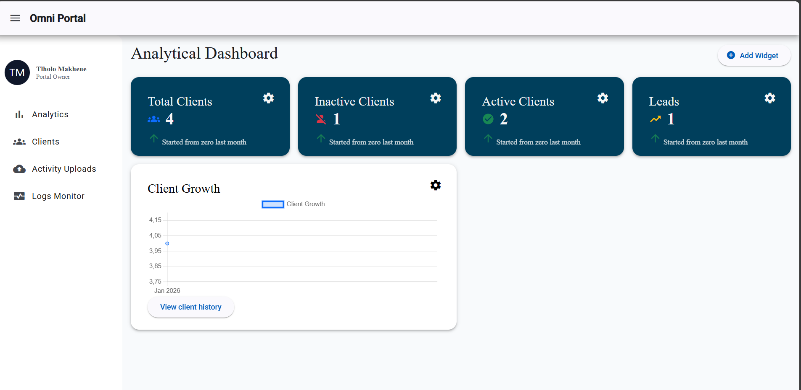
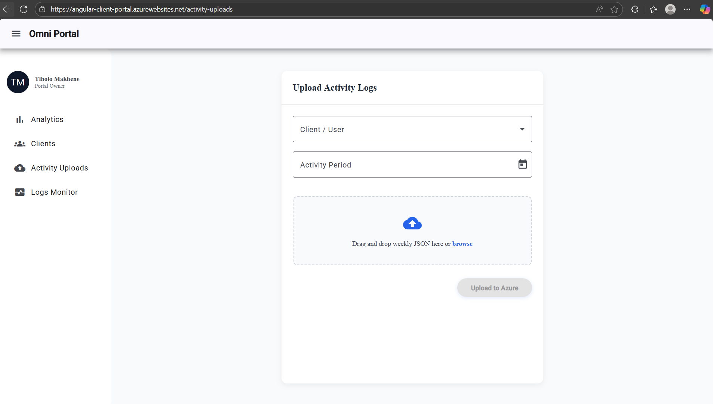

# Angular Client Portal

A modern Angular application that communicates with a backend Web API to manage clients, visualise data, and process weekly activity uploads. The application follows current Angular best practices and focuses on maintainability, performance, and a clean user experience.

🔗 **Live Application**  
https://angular-client-portal.azurewebsites.net/clients

---

## Overview

The **Angular Client Portal** is a front-end application built to interact with a RESTful Web API that exposes a **Client** resource. The application provides full CRUD functionality, analytical dashboards, file-based activity uploads, and access to system logs for monitoring and troubleshooting.

The UI is built using **Angular Material** with theming support and leverages **Chart.js** for data visualisation.

---

## Features

### 📊 Dashboard
- High-level overview of client data
- Summary metrics such as:
  - Total Clients
  - Active / Inactive Clients
  - Leads
- Interactive charts powered by **Chart.js**
- Designed for quick insight into system activity and trends

---

### 👥 Client Management
- Full CRUD operations for clients:
  - Create new clients
  - View client details
  - Update existing client information
  - Delete clients
- Data persisted via REST API endpoints
- Uses Angular Material tables for clean data presentation

---

### 📤 Activity Upload
- Upload weekly client training or activity files
- Files are sent to the backend for processing
- Supports batch ingestion of client-related information

---

### 🧾 System Logs
- View system-level logs exposed by the backend
- Intended for operational monitoring and diagnostics
- Read-only access from the front-end

---

## Technical Stack

### Frontend
- **Angular (Standalone Components)**
- **Angular Signals** for reactive state management
- **Angular Material UI** with custom theming
- **Chart.js** for dashboard visualisations
- **SCSS** for styling

---

### Communication & State
- **HttpClientModule** for API communication
- REST-based integration with a Web API
- Uses basic **RxJS operators** such as:
  - `map`
  - `tap`
  - `catchError`

---

## Architecture Highlights

- Standalone components (no NgModules)
- Feature-based component structure
- Services handle API communication
- Dashboard widgets designed as reusable components
- Clear separation between UI and data logic

---

## API Integration

The application communicates with a backend Web API that exposes endpoints for:

- Client CRUD operations
- Weekly activity upload and processing
- System log retrieval

All API calls are handled through Angular services using `HttpClient`.

---

## Screenshots

> 📸 Dashboard, Client Management & Activity Uploads UI






## Running the Application Locally

### Prerequisites
- **Node.js**
- **Angular CLI**

### Steps

Install project dependencies:

```bash
npm install
Start the development server:

ng serve
The application will be available at:

http://localhost:4200
Ensure the backend Web API is running and accessible, or update the environment configuration accordingly.

Notes
The application is designed to be easily extended with additional dashboard widgets.

Angular Material theming is used to maintain a consistent and accessible user interface.

The project structure supports future growth without requiring major refactoring.

License
This project is intended for internal, learning, or demonstration purposes.
